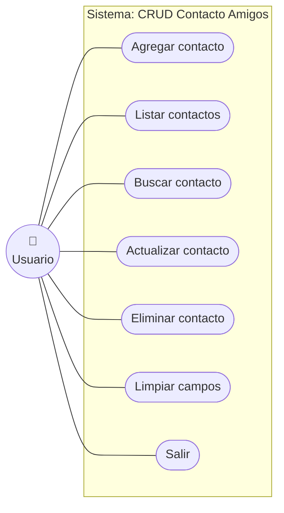

# Diagrama de Casos de Uso

Proyecto: **CRUD Contacto Amigos** (Java Swing + POO)

Existe un único actor, el **Usuario**, que gestiona su agenda de contactos
amigos a través de la ventana. Cada botón de la interfaz corresponde a un
caso de uso.

## Descripción de los casos de uso

| Caso de uso | Botón | Descripción |
|-------------|-------|-------------|
| **Agregar contacto** | `Create` | Toma nombre, teléfono y correo, y crea un nuevo contacto en el archivo (si no existe ya uno con ese nombre). |
| **Listar contactos** | `Read` | Lee el archivo y muestra todos los contactos guardados. |
| **Buscar contacto** | `Buscar` | Busca por nombre y, si existe, rellena los campos con sus datos. |
| **Actualizar contacto** | `Update` | Modifica los datos del contacto cuyo nombre coincide con el campo *Buscar*. |
| **Eliminar contacto** | `Delete` | Borra del archivo el contacto cuyo nombre coincide con el campo *Buscar*. |
| **Limpiar campos** | `Limpiar` | Vacía todos los campos de texto del formulario. |
| **Salir** | `Salir` | Cierra la aplicación tras confirmar. |

## Flujo principal (ejemplo: Agregar contacto)

1. El usuario escribe nombre, teléfono y correo.
2. El usuario pulsa **Create**.
3. El sistema verifica que no exista otro contacto con el mismo nombre.
4. El sistema guarda el contacto en el archivo `Contacto_amigos.txt`.
5. El sistema muestra el mensaje *"Contacto agregado."* y limpia los campos.
