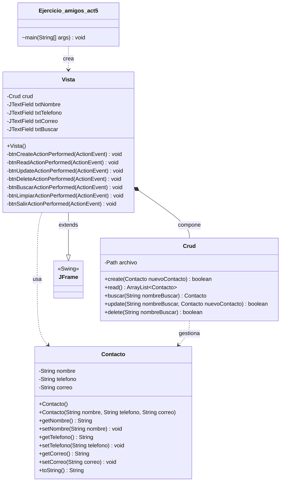

# Diagrama de Clases

Proyecto: **CRUD Contacto Amigos** (Java Swing + POO)

Este diagrama muestra las clases del proyecto y sus relaciones. La aplicación
sigue una separación por responsabilidades:

- `Contacto` → **Modelo** (los datos de un contacto).
- `Crud` → **Lógica de negocio / persistencia** (leer y escribir el archivo).
- `Vista` → **Interfaz gráfica** (ventana Swing).
- `Ejercicio_amigos_act5` → **Punto de entrada** (arranca la aplicación).

## Relaciones

| Relación | Tipo | Descripción |
|----------|------|-------------|
| `Vista` → `JFrame` | Herencia | `Vista` extiende `javax.swing.JFrame`. |
| `Ejercicio_amigos_act5` → `Vista` | Dependencia | El `main` instancia y muestra la ventana. |
| `Vista` → `Crud` | Composición | `Vista` contiene un objeto `Crud` como atributo. |
| `Vista` → `Contacto` | Dependencia | Crea objetos `Contacto` con lo que el usuario escribe. |
| `Crud` → `Contacto` | Dependencia | Devuelve/gestiona objetos `Contacto` desde el archivo. |
